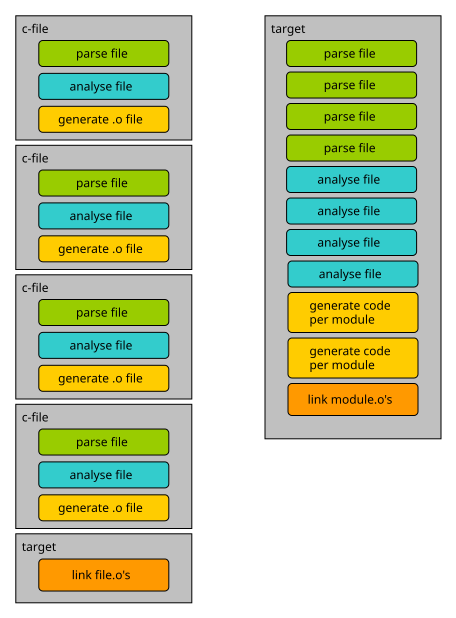

__NOTE:__ None of this should be read as an attack on C. C is a great language that
has survived the test of time for more than 50 years — respect to its designer.

*"Evolution consists of mutation and selection..."*

In other words, C2 __changes the bad__ things and __keeps the good__ things of C.

Things that are widely seen as *bad* nowadays, and that can be improved:

- header-file includes
- complex, hard-to-read type syntax
  (can you read ```char *(*(**foo [][8])())[];```? see the bottom of the page for the correct answer)
- a language that is very hard to build tooling for
- a mandatory, external build system

C was designed in an era when compilers had to work with very limited processing
power and memory. Those restrictions no longer apply, so it makes sense to shift more
of the burden onto the compiler and less onto the developer.

One of the biggest pain points in C is header-file includes. The clang
website has a [good article](http://clang.llvm.org/docs/Modules.html#problems-with-the-current-model) on
the problems of `#include`.
Because `#include`s are recursive, the compiler often ends up parsing and analysing far
more than just your own code. Measurements on typical C code have found a ratio of user
code to external (header) code of roughly 1 to 50 — so for every line of code you write,
the compiler may need to parse and analyse 50 more.

Frequent use of preprocessor macros adds to the pain, giving headaches to tool
developers and static analysers alike.

## Overview of changes
This section describes the main differences between C and C2.

### No header files
C2 takes a modern approach to using external symbols. There is only one kind of
source file, the **.c2** file. In place of `#include`, there is an __import__
statement, and all source code is organized into [modules](../language/modules.md).

### No mandatory declaration ordering
C2 has no *forward declarations* of any kind. Every declaration is written in a
single place, and there are no ordering requirements within a source file: top-level
declarations may appear in whatever order best suits the programmer, rather than the
order the compiler happens to need, as in C. The example below is valid C2:

```c
// type Number and global variable n are used here
fn void add(Number a) { total += a; }

// type Number is used here
Number total = 10;

// type is only defined here
type Number i32;
```

### Integrated build system
Integrating the build system into the compiler may look restrictive at first, but
it actually unlocks a lot of improvements. See [the build system](../build_system/intro.md)
for a full description; a `recipe.txt` file describes the executables/libraries
(_targets_) to build and which modules go into each one.

C2C is a multi-pass compiler that analyses a whole program before generating any
code. The image below contrasts this with traditional, per-file C compilation.


In C, the compiler is invoked separately for each `.c` file: it parses, analyses,
and generates object code for that file alone, before the linker combines all the
resulting object files into an executable or library.

In C2, all files of a target are first parsed, then analysed together in successive
passes, and code generation only starts once analysis has found no errors.

Code generation (and any optimization) is by far the most time-consuming part of the
pipeline. So with 100 C source files, a syntax error in the 99th one is only reported
after the first 98 have already been fully compiled. In C2, since generation is
deferred until the whole program has parsed and analysed cleanly, that same error
surfaces almost immediately — developers never wait on code generation just to see a
diagnostic.

### Compilation per target, not per file
Because the build system knows about whole targets rather than individual files, a
target can also choose *how* it wants to be turned into machine code, via the
`$backend` setting in its recipe (see [Recipe file](../build_system/recipe_file.md)):

* `$backend c` (the default) — c2c transpiles the target's C2 sources to portable C,
  which is then compiled and optimized by a regular system C compiler (gcc/clang).
  This gives every existing C toolchain, optimizer and cross-compiler for free.
* `$backend ir` — c2c generates code itself, straight down to machine code for
  amd64, arm64 or riscv64, through its own SSA-based intermediate representation and
  register allocator, without shelling out to an external compiler at all.

Either way, the whole target is compiled as one program-wide unit rather than file by
file, so the codegen backend always has the complete picture instead of just one
translation unit's worth of it.

The *visibility* of symbols in the resulting binary can also be controlled directly,
without linker scripts or extra tooling, as described in
[export control](../build_system/symbols.md).

### Built-in primitive types
C2 provides the following built-in primitive types:

* __bool__
* __char__
* __i8__, __i16__, __i32__, __i64__
* __u8__, __u16__, __u32__, __u64__
* __isize__, __usize__
* __f32__, __f64__

The standard __int__, __float__ and __double__ types are gone, along with modifiers
such as __short__, __long__, __signed__ and __unsigned__. They only remain available
in C2 interface files, for describing existing C libraries.

The `NULL` macro has been replaced by the __nil__ keyword.

### Uniform type-definition syntax
Type definitions in C are sometimes hard to read, and `typedef`'s syntax doesn't
help. C2 instead provides one uniform syntax for defining new types, as shown
[here](../language/user_types.md).

### Stricter diagnostics
Plenty of C projects lose real time tuning warning levels, since getting good
diagnostics out of a C compiler means passing it a long list of options.

C2 only warns about a handful of things (mostly unused imports/types/vars/functions);
everything else that a C compiler might merely warn about is simply an error in C2.
Examples of things that are errors in C2:

* using an uninitialized variable
* not returning a value from a non-void function
* certain unsafe type conversions

Thanks to these stricter diagnostics, c2c always points at the exact error location,
names the kind of error, and in some cases even suggests a fix — for a missing
semicolon after a function call, for example. This saves development time, since you
no longer need to hunt for the root cause the way you sometimes do in C.

### Attributes
C2 has [attributes](../language/attributes.md) built into the language design. A set
of standardized attributes is available out of the box, and compiler-specific ones
remain available too, which simplifies writing multi-platform code.

### Tooling
Because c2c's parser and analyser are available as reusable components, other tools
can be built on top of them. One example is __c2rename__, C2's rename/refactoring
tool, which uses the same symbol resolution as the compiler itself.

### Special features
C2 also introduces some new features:

* [incremental arrays](../language/variables.md#incrementally-declared-arrays)
* [c2 pseudo-module](../build_system/c2module.md)


#### correct answer for the type declaration above
foo is an array of arrays of 8 pointers to pointers to a function returning a pointer to an array of char pointers.
